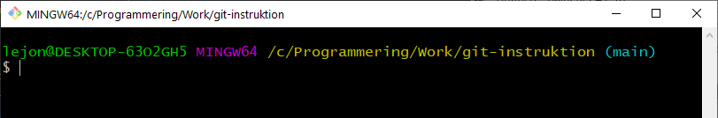

# Terminalen

### 1 Historia
Innan datormusen fanns, så använde man bara tangentbordet för att styra datorn. Datorerna hade inte heller tillräcklig prestanda för att visa grafiska gränssnitt. Man använde så kallade **terminalprogram**.


#### Kända terminalprogram
+ Bash- och Zsh-familjerna
	+ Bash (Linux)
	+ Git bash (Windows)
	+ Terminal (macOS)
	+ Oh My Zsh (macOS)
+ Cmd-familjen
	+ Cmd / Kommandotolken (Windows)
	+ PowerShell (Windows)

---
**Övning**: starta ett terminalprogram på din dator.

**Övning**: om du använder Windows, ladda ner och installera Git Bash (följer med Git).

[Download Git + Git Bash](https://git-scm.com/downloads) |

---
### 2 Exempel - Git Bash
---


Git Bash är en bra, kompetent terminal som följer med när man installerar Git.

Gul färg visar vilken mapp man befinner sig i för tillfället.

Ljusblå färg dyker upp om du befinner dig i ett git-repository. Den visar vilken *branch* man står i. (se [sidan som handlar om Git](git.md))

Det vita dollartecknet på raden efter kallas för *prompt*. Det är där man skriver in kommandon.

---

### 3 Filer, mappar, kataloger
Filerna i en dator ligger ordnade i mappar. Mappar kan innehålla andra mappar.

|Tecken |Engelskt namn |Svenskt namn |
|-|-|-|
|`~` |Tilde         |Tilde |
|`/` |Forward slash |Snedstreck |
|`\` |Backslash     |Omvänt snedstreck |

macOS och Liunx har sökvägar som börjar exempelvis med `/usr/home` eller `~/`. Tecknet tilde `~` betyder "användarens hemmamapp". Snedstrecken *lutar åt höger*.


Windows har sökvägar som börjar med `C:\Användare\` eller `"Mina dokument"`. Snedstrecken *lutar åt vänster*. Om en sökväg innehåller mellanslag, måste du använda citattecken.

|Engelsk term |Svensk term |
|-------------|------------|
|File         |Fil         |
|Directory    |Katalog     |
|Folder       |Mapp        |

*Finder* (macOS) och *Explorer/Utforskaren* (Windows) är grafiska program för att se vilka filer som finns på din dator.

---
*Tips 1: många program som programmerare använder förutsätter att man använder macOS-sökvägar, även om man kodar på en Windows-dator.*

*Tips 2: undvik svenska tecken och mellanslag i dina mappnamn! En del frontend-verktyg klarar inte av dem.*

#### Exempel
```bash
# Gå in i mappen exercise-1
cd skola/css/exercise-1/

# Nu är aktuell mapp: exercise-1 (inklusive hela sökvägen)
# Punkt är ett alias för sökvägen
cd .
# Ingen förändring - vi är kvar i samma mapp

# För att backa ett steg (gå "upp" ett steg) skriver vi två punkter
cd ..
# Nu är aktuell mapp: css

cd ../javascript1
# Nu har vi bytt sökväg till: skola/javascript1/
```

#### Dolda filer
Vissa filer eller mappar kan vara *dolda*. Det innebär att de inte syns varken i Finder eller Explorer, eller när du skriver `ls`. Unix-baserade system brukar göra filer som börjar med punkt osynliga. Exempel: `.git`-mappen.

Göra dolda filer synliga med explorer:


---
**Övning**: öppna Finder eller Explorer. Skapa en mapp med namnet "Skola". Gå in i den mappen och skapa en mapp för din nuvarande kurs. Skapa en till mapp inuti den med namnet "terminalen".

---


### 4 Smarta genvägar
De flesta terminaler har liknande kortkommandon.

|Kommando |Funktionalitet |
|---------|---------------|
|Tab |Autocomplete på kommandon och sökvägar |
|Uppåtpil |Bläddra till tidigare kommando i historiken |
|Nedåtpil |Bläddra till senare kommando i historiken |
|`pwd` |Visar vilken mapp du befinner dig i. |
|`clear` |Rensa terminalfönstret |
|`cd sökväg` |Gå till en annan mapp |
|`mv fil destination` |Flytta fil eller mapp till en annan plats, eller byt namn. |
|`rm fil` |Ta bort en fil från hårddisken |
|`ls` |Lista filer i aktuell mapp |
|`ls -al` |Som `ls`, men visa även dolda filer |
|`sudo kommando` |På macOS och Linux behöver man ibland autentisera sig som adminstratör. Om du får felet "Permission denied", prova att lägga till `sudo` först på raden. |

---
**Övning**: träna på att skriva kommandon i terminalen, i din mapp "terminalen".

---
